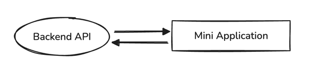

# Digital Resistance Project

This repository contains the source code for
the [Digital Resistance](https://t.me/tgresistancebot)
mini application, a project dedicated to promoting freedom of speech and
advocating for Pavel
Durov’s release.

## Disclaimer

This repository provides information about the client-side implementation of the
project. The
backend portion may be included later, but currently, it only contains the mini
application code
along with its Backend-for-Frontend (BFF) code.

Please note that the code was developed over one or two days, so the quality
might seem unusual. It
was quickly refactored to improve readability and flow.

> [!WARNING]
> Use this code for educational purposes only and avoid using it as a direct
> template. The project
> was built in a "hackathon" mode, which prioritizes speed over code quality.

## Features

- **Internationalization**
  with [i18next](https://www.npmjs.com/package/i18next).
- **Event logging** using [Mixpanel](http://mixpanel.com).
- **Error logging** using [Sentry](https://sentry.io).
- **BFF server implementation** that serves as a proxy with security
  improvements.

## Libraries

### General

- **[yarn](https://yarnpkg.com/)** for package management.
- **[imagemin](https://www.npmjs.com/package/imagemin)** for image optimization
  and compression.

### Backend-for-Frontend (BFF)

- **[express](https://www.npmjs.com/package/express)** as the server framework.
- **[helmet](https://www.npmjs.com/package/helmet)** to secure the app by
  setting HTTP headers.
- **[cors](https://www.npmjs.com/package/cors)** for configuring CORS.

### Mini Application

- **[React](https://react.dev/)** as the main rendering library.
- **[CRA (Create React App)](https://create-react-app.dev/docs/getting-started/)
  ** to initialize the
  app.
-
    *

*[@telegram-apps](https://docs.telegram-mini-apps.com/packages/telegram-apps-sdk-react/2-x)
** for
integrating Telegram Mini Apps functionality.

## Environment Variables

| Name                     | Required | Description                                                                                        |
|--------------------------|----------|----------------------------------------------------------------------------------------------------|
| TELEGRAM_BOT_TOKEN       | Yes      | The Telegram Bot token from [@BotFather](https://t.me/botfather), used for BFF request validation. |
| SERVER_PORT              | Yes      | Port for the BFF server.                                                                           |
| REACT_APP_API_BASE_URL   | No       | Base URL for the BFF used by the client application.                                               |
| REACT_APP_MIXPANEL_TOKEN | Yes      | Mixpanel token for event tracking.                                                                 |
| REACT_APP_SENTRY_DSN     | Yes      | Sentry DSN for error logging.                                                                      |

## Getting Started

### Step 1: Configure Environment Variables

Create a `.env` file and add the required environment variables as outlined in
the [Environment Variables](#environment-variables) section.

### Step 2: Install Dependencies

Install the necessary dependencies:

```bash
yarn
```

### Step 3: Run in Development Mode

To start development mode, use:

```bash
yarn run dev
```

This will concurrently run the BFF and the client application in development
mode, opening the
application at `http://localhost:3000`.

### Step 4: Create a Tunnel

To develop the application within Telegram, an HTTP tunnel is required. You can
use tools
like [localtunnel](https://npmjs.com/package/localtunnel)
or [ngrok](https://www.npmjs.com/package/ngrok).

Example using `ngrok`:

```bash
ngrok http 3000
```

This will provide an HTTPS URL to use in the BotFather mini app settings.

### Step 5: Open the App

Once the tunnel URL is set in BotFather, launch the mini application and verify
it’s working.

## Building

To build the application, run:

```bash
yarn run build
```

This will pull the latest `@telegram-apps/analytics` script and build the
application in the `dist`
folder.

To start in production mode, use:

```bash
yarn run start:prod
```

## Backend-for-Frontend vs. Client-Side Only

This section is dedicated to comparing two approaches available in this
application: Backend-for-Frontend (BFF) and client-side only.

### Backend-for-Frontend


Backend-for-Frontend is a part of the application that serves as a layer between
the client application and the server. In other words, it acts as a proxy
responsible for filtering client application requests and redirecting them to
valid HTTP endpoints. Additionally, the BFF functions as a static assets server,
allowing users' browsers to download the application files.

Another important feature of this component is its ability to control the HTTP
headers sent along with the client application’s static assets. This approach
enables developers to implement a greater number of security mechanisms, as well
as specific and flexible web features beneficial for developers.

However, the BFF requires a dedicated server, which necessitates additional code
adjustments. Moreover, if BFF is implemented incorrectly, you may lose
client-side-only features, such as CDN support.

### Client-Side Only



This is the classic approach used in simple web applications.

The first feature here is that the application infrastructure is very
straightforward; your application communicates directly with the backend API
without any additional layers.

The second feature is the availability of numerous free static asset hosting
options, such as Vercel, GitHub Pages, and Telegram Mini Apps. Thus, you don’t
have to worry about how to serve your static files quickly.

### Conclusion

Despite the fact that implementing the BFF is a more complex task, it is
recommended to use this approach, as it offers more useful features for both
developers and users.